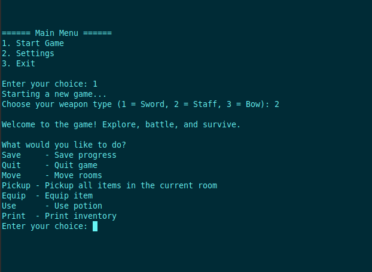
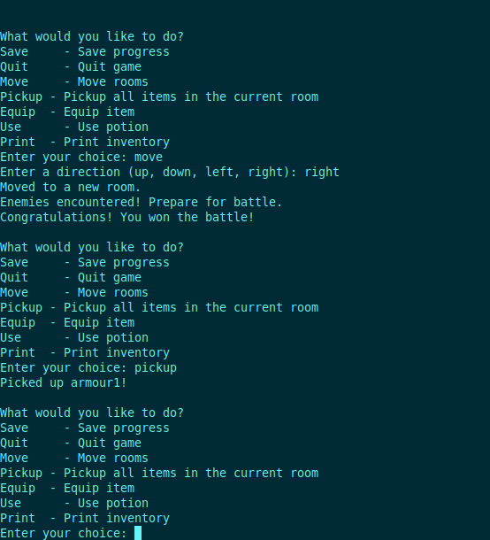
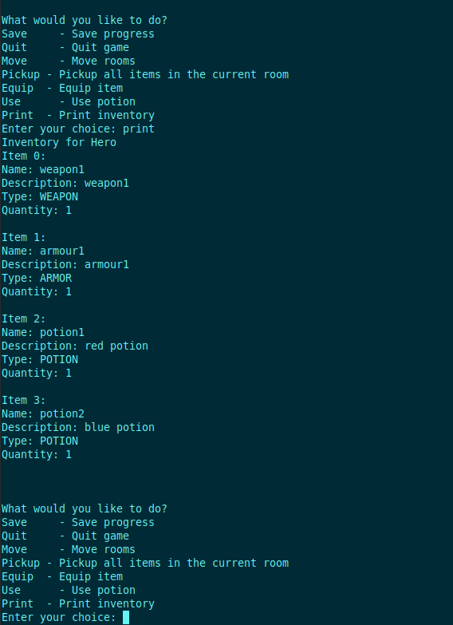
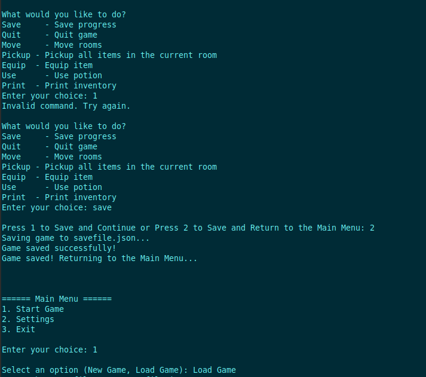
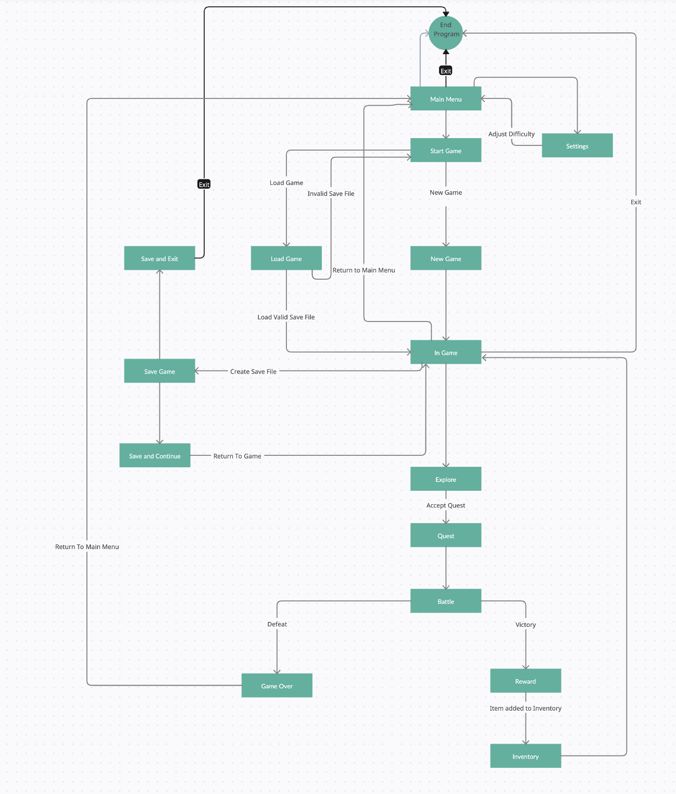
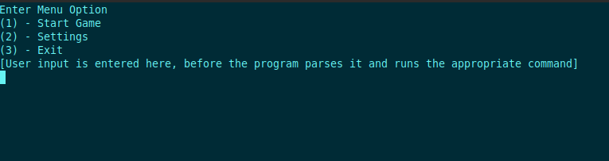
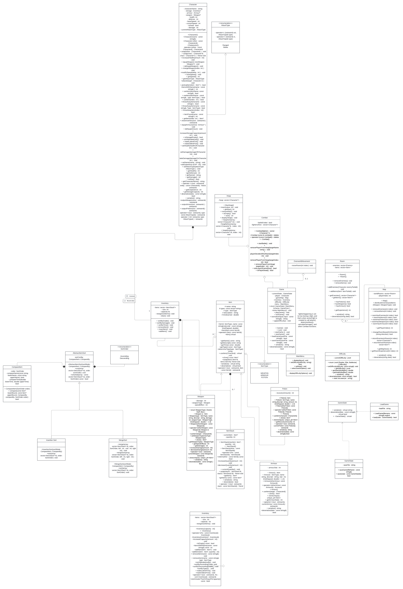
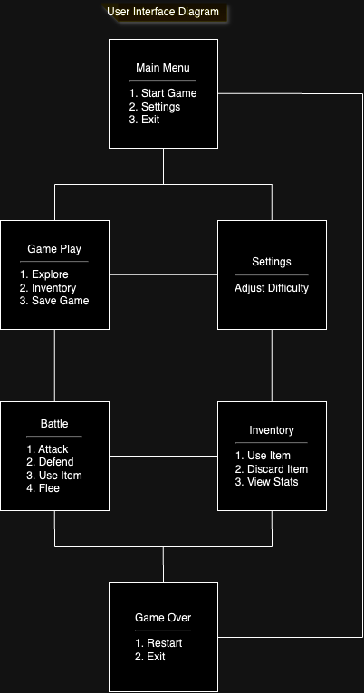

## Overview

Battlestar RPG is a terminal-based, turn-based game implemented in C++ using object-oriented principles and modular class design. This project simulates a role-playing battle system with difficulty scaling, inventory management, and user interaction via text I/O.

It was built collaboratively as a capstone for a software construction course at UC Riverside. Emphasis was placed on applying SOLID design principles, writing clean and extensible code, and working in a multi-member GitHub environment with version control, code reviews, and feature-based branching.

**Note**: This project reflects collective team contributions. For solo projects and individual development work, please refer to my [`internship-prep-2025`](https://github.com/aryamohammadi/internship-prep-2025) repository.

# BRPG - Battlestar RPG
Battlestar RPG is a turn-based, text-based combat game written in C++. It was designed as part of a collaborative software construction course at UC Riverside to demonstrate object-oriented design, modular architecture, and the practical application of SOLID principles.
> Your author list below should include links to all members GitHub (remove existing author).
> Authors: [Jameel Simjee](https://github.com/JSimjee), [Matthew Acosta](https://github.com/macos052), [Jessy Garcia](https://github.com/jgarc826), [Arya Mohammadi](https://github.com/aryamohammadi), [Ryan Jourdain](https://github.com/RJourdain)

## Project Description
> * Why we are doing this project
>   - Our team will implement and deepen our understanding of c++ concepts such as object oriented programming, data structures and algorithms. This project will also give us a chance to collaborate with our team and reinforce our knowledge of object oriented programming, therefore simulating a real industry-like environment where collaboration and teamwork is key in order to be successful. 
>   - By working on this project as a team, we will improve our ability to communicate, solve problems as a team, and manage code through version control.
>   - This project is complex enough for us to utilize object oriented programming,
> * Languages, Tools, and Technologies Planned
>   - C++: The primary programming language we will be using is C++. We will utilize Object-oriented principles such as classes for characters, items, and environments. Data structures and sorting algorithms can be used for various in-game effects.
>   - Github/Git: version control will be managed through Github. This allows us to collaborate with each other and keep track of the development process.
>   - Visual Studio Code: We will use VS Code as our Integrated Development Environment. 
>   - Terminal: The user will be interacting with the program through the Terminal.
> * User Input and Screen Output
>   - Input: 
>     - Specific variables will be predetermined, such as types of weapons, types of movement, and the specifics of enemies attacking you.
>     - The following would take in user input
>       - Username, as a string.
>       - Environment variables. For example, a series of pre-made environments could be selected from. Or other random elements of the game could be determined by a user-inputted seed.
>       - Actions the character takes, such as using an item, launching an attack, or for pre-determined movement. This would be a regularly appearing menu, with char variables used to determine the actions taken. 
>       - A menu of the game where settings are changed, such as difficulty, using an item, or knowing some in-game progress. 
>   - Output:
>     - Variations of preset output lines will be printed to the screen. For example, "[Username] attacks [Enemy name] for [Dmg] damage!"
>     - We can also incorporate unique types of output as well, such as primitive text-based artwork showcasing the environment the player is in. 
> * Project and Gameplay Features
>   - Difficulty selection
>     - By changing the stats for player and enemy characters, the quantity and quality of items, and attributes of the environment, the player will have an easier or more difficult experience.
>   - Simple combat system: the player engages in battles by choosing actions such as “attack,” “defend,” or “use item”. The outcome will be dependent on the player's stats, enemy stats, and random number generation.
>   - Players can level up their characters (improve stats such as health, attack power, and defense). This helps them with progressing through the game as it gets more challenging.

> ## Phase III
> BEFORE the meeting you should do the following:
> * Make sure that your README file (and Project board) are up-to-date reflecting the current status of your project and the most recent class diagram. Previous versions of the README file should still be visible through your commit history.

> Combat Class changes:
> * When designing the Combat class, I made sure to follow the interface segregation principle. Each function in the class is specific and focused on combat-related functionality. The class does not include any functions that do not contribute to the purpose of the Combat class.

> Item and Sorting Classes:
> * To follow the ISP, I seperated my large interface inventory and the small interface sorting into seperate classes. Then, I would create an object of the sort class and call it in inventory. It allowed me to decide the sorting alogirthm without having to change too much code or if statements.

> Map and Room Classes:
> * To follow the Single Responsibility Principle, I delegated unique responsibilities to the Map and Room classes that separated their uses. While the two classes rely on each other due to their aggregation and 

> MaxHeap Class:
> * 1. Single Responsibility Principle (SRP)
> * * I applied the Single Responsibility Principle by making sure that the MaxHeap class has a single responsibility which is managing a heap structure and its associated operations such as insertion, deletion, and maintaining the max-heap property.

> * * The MaxHeap class only focuses on heap-related functionality. It does not handle unrelated tasks, such as interacting with game characters or other elements. This ensures that the purpose of the class is clear.

> * * By adhering to SRP, the MaxHeap class is easier to maintain and test. Also, future modifications will not impact the unrelated parts of the codebase. 

> * 2. Open/Closed Principle (OCP)
> * * I applied the Open/Closed Principle by implementing the MaxHeap as a generic container that can be reused for different data types, such as integers or objects like Character.

> * * Using templates or designing the MaxHeap to work with function pointers or functors allows the class to handle different sorting orders or data types without modifying its main implementation.

> * * This change makes the MaxHeap reusable easier to extend. For example, we can use the same MaxHeap implementation for priority-based gameplay systems or inventory management without changing its code.

> * 3. Liskov Substitution Principle (LSP)
> * * I made sure that the swap and copy functions follow the Liskov Substitution Principle by maintaining consistency across all instances of MaxHeap.

> * * The swap function and copy operations were implemented to handle the internal vector and all member variables correctly. This makes sure that any copied or swapped heap acts exactly like the original to maintain the max-heap property.

> * * This makes sure that MaxHeap objects stay the same after copying or swapping. It stops it from unexpected behavior in code that relies on heap properties. This helps the program to be more reliable.

> * 4. Dependency Inversion Principle (DIP)
> * * I utilized the Dependency Inversion Principle by making sure that MaxHeap does not depend directly on specific data types, like Character. It works with a vector of generic elements or through abstractions like templates.

> * * The MaxHeap implementation is very simple and generic and it works with any type that supports comparison. This abstraction helps the heap to manage a variety of data without being associated with a specific type.

> * * This abstraction increases the reusability of the MaxHeap class and allows it to be integrated into different systems without requiring modification.

> MainMenu Class:
> * The MainMenu class is responsible for displaying the menu and handling user interaction like selecting game options or difficulty. Follows the SRP as the class is focused solely on managing the user interface of the main menu. It doesn’t handle gameplay, difficulty logic, or other unrelated functionality. The MainMenu class also follows the OCP as it can be extended by adding new menu options or behaviors without modifying its existing methods. The MainMenu class operates independently of the Difficulty class. It uses a simple setDifficulty method internally and does not depend on the concrete implementation of Difficulty. This separation ensures that MainMenu does not violate DIP. Adhering to the SOLID principles has made it so that integration with the main branch and other features of the program should be very straight forward.

> Difficulty Class:
> * The Difficulty class manages the game's difficulty level, which includes modifiers for attack, defense, and health. The Difficulty class is self-contained and does not depend on any other class. 
This class complies with SRP as it focuses only on encapsulating the logic for difficulty levels and their associated multipliers. It doesn’t handle user input, gameplay, or display logic. This design aligns with DIP because it does not tightly couple itself to higher-level modules like MainMenu. Adhering to the SOLID principles made it so it will be easy for the members of our team to utilize the difficulty class in other features.

> ## Final deliverable
> All group members will give a demo to the reader during lab time. ou should schedule your demo on Calendly with the same reader who took your second scrum meeting. The reader will check the demo and the project GitHub repository and ask a few questions to all the team members.
> Before the demo, you should do the following:
> * Complete the sections below (i.e. Screenshots, Installation/Usage, Testing)
> * Plan one more sprint (that you will not necessarily complete before the end of the quarter). Your In-progress and In-testing columns should be empty (you are not doing more work currently) but your TODO column should have a full sprint plan in it as you have done before. This should include any known bugs (there should be some) or new features you would like to add. These should appear as issues/cards on your Project board.
> * Make sure your README file and Project board are up-to-date reflecting the current status of your project (e.g. any changes that you have made during the project such as changes to your class diagram). Previous versions should still be visible through your commit history.
>  * Each team member should also submit the Individual Contributions Form on Canvas for this final phase. In this form, you need to fill in the names of all team members, the percentage of work contributed by each member for the final phase, and a description of their contributions. Remember that each team member should submit the form individually.

## Screenshots

### User Interface Diagrams

#### Navigation Diagram

#### Sample Output

#### UML Diagram

#### User Interface Diagram

## Installation/Usage
> Instructions on installing and running our application:
> Clone the repository locally, run the following commands from the cloned folder
> * cmake .
> * make
> * ./bin/Game
> ## Testing
> We tested using the googletest libraries, with common assertions and expectations for various functions throughout our program

